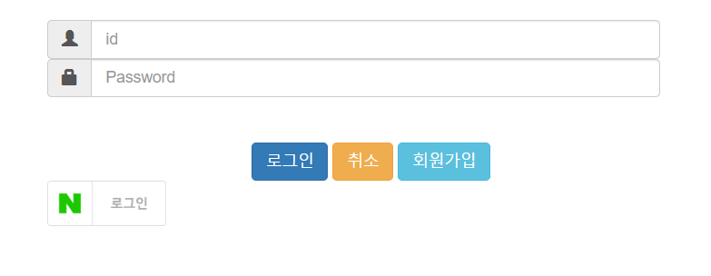
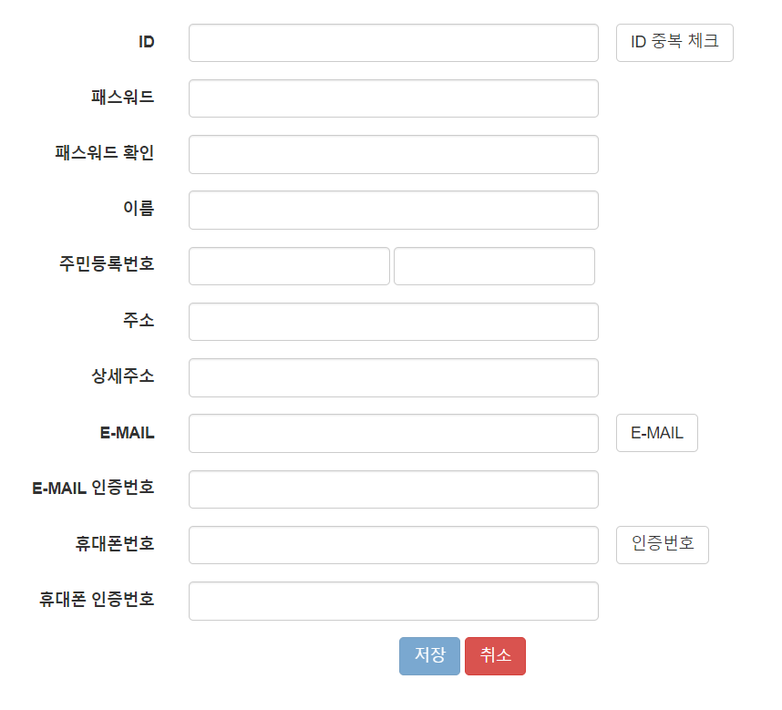
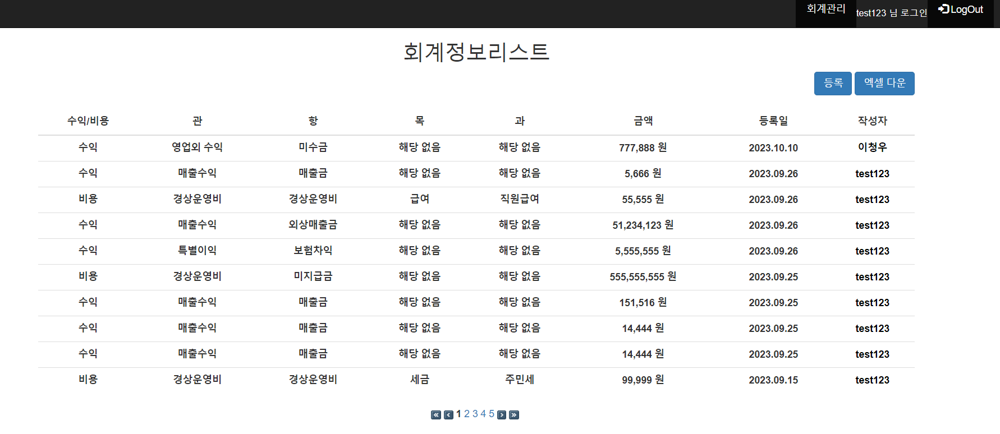
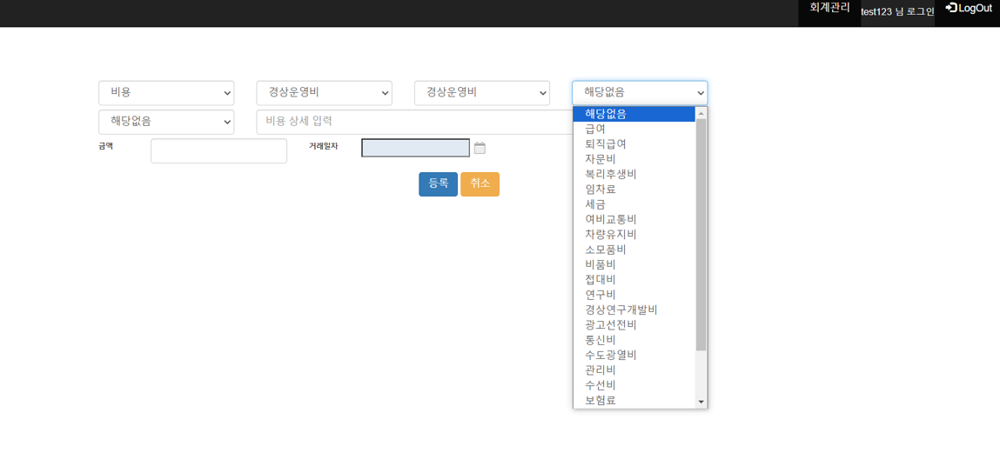
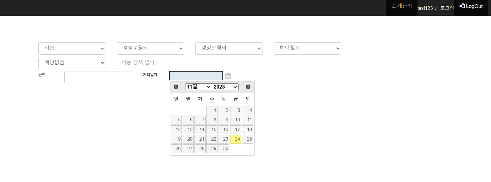
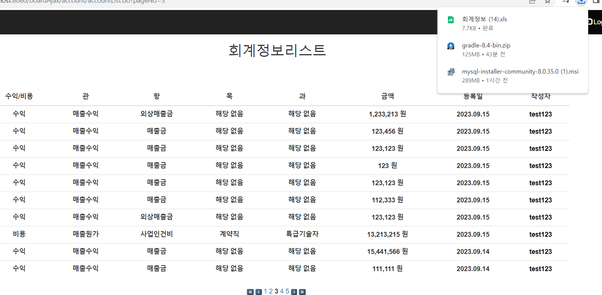

# 

## 프로젝트 개요
이 프로젝트는 Ajax를 통해 다중콤보박스 구현과 네이버/카카오/구글의 OpenAPI를 활용,엑셀파일 다운 기능을 학습하기 위한 프로젝트입니다.

## 프로젝트 기간
- 시작일: 2023.09.11
- 종료일: 2023.09.22

## 개발 도구
- 개발 환경:  

  **Front**
  
    
  
  **Back**
  
   

  **DataBase**

  
  
  ** 주요 라이브러리**
  
   Gson
  
  **API**
  
  Daum, Google, Naver
  
  
## 기능설명

### Login page 
---

### Sign Up Page (Google의 E-mail인증 서비스 & naver 휴대폰 인증 서비스 & 다음 주소 API 사용)
--- 

### Main Page (List)
--- 

### Insert Page (MultiSelectComboBox)
--- 

### Insert Page (DatePicker)
--- 

### Main Page(Exel Download)
--- 

---

